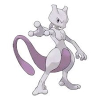

<a id="readme-top"></a>

[![Contributors][contributors-shield]][contributors-url]
[![Forks][forks-shield]][forks-url]
[![Stargazers][stars-shield]][stars-url]
[![Issues][issues-shield]][issues-url]
[![Unlicense License][license-shield]][license-url]
[![LinkedIn][linkedin-shield]][linkedin-url]

<!-- PROJECT LOGO -->
<br />
<div align="center">
  <a href="https://github.com/CodecoolGlobal/gotta-fetch-em-all-react-Akoss08">
    
  </a>

  <h3 align="center">Gotta fetch 'em all</h3>

  <p align="center">
    Travel, explore, and catch Pokémons in React!
    <br />
    <a href="https://github.com/CodecoolGlobal/gotta-fetch-em-all-react-Akoss08"><strong>Explore the docs »</strong></a>
    <br />
    <br />
    <a href="https://github.com/CodecoolGlobal/gotta-fetch-em-all-react-Akoss08">View Demo</a>
    &middot;
    <a href="https://github.com/CodecoolGlobal/gotta-fetch-em-all-react-Akoss08/issues/new?labels=bug&template=bug-report---.md">Report Bug</a>
    &middot;
    <a href="https://github.com/CodecoolGlobal/gotta-fetch-em-all-react-Akoss08/issues/new?labels=enhancement&template=feature-request---.md">Request Feature</a>
  </p>
</div>


<!-- TABLE OF CONTENTS -->
<details>
  <summary>Table of Contents</summary>
  <ol>
    <li>
      <a href="#about-the-project">About The Project</a>
      <ul>
        <li><a href="#main-features">Main Features</a>
        </li>
        <li><a href="#built-with">Built With</a></li>
      </ul>
    </li>
    <li>
      <a href="#getting-started">Getting Started</a>
      <ul>
        <li><a href="#prerequisites">Prerequisites</a></li>
        <li><a href="#installation">Installation</a></li>
      </ul>
    </li>
    <li><a href="#usage">Usage</a></li>
    <li><a href="#roadmap">Roadmap</a></li>
    <li><a href="#contributing">Contributing</a></li>
    <li><a href="#license">License</a></li>
    <li><a href="#contact">Contact</a></li>
    <li><a href="#acknowledgments">Acknowledgments</a></li>
  </ol>
</details>


<!-- ABOUT THE PROJECT -->
## About The Project

![Battle Scene][battlescene-screenshoot]

Welcome to the Pokémon Battle Game! This is a fun, interactive game where you can travel through various locations, catch wild Pokémons, and battle them using your trusty team of Pokémons. Here’s how the game works:

### Main Features:
* <u><i>Explore Locations:</i></u> On the main page, you’ll find a list of locations. You can easily switch between pages to explore different areas and discover new Pokémon.

* <u><i>Random Enemy Encounters:</u></i> When you click on a location, a random enemy Pokémon from that area will appear, ready for battle.

* <u><i>Battle Mechanics:</u></i> You start with 3 base Pokémon, and you choose which one you want to send into battle against the enemy. The battle is automated based on each Pokémon’s attributes like health, damage, and defense.

* <u><i>Winning or Losing:</u></i> If you win the battle, you catch the enemy Pokémon and it will join your collection for future battles. If you lose, your Pokémon is gone, lost forever. So choose wisely!

* <u><i>Pokéball Feature:</u></i> On the main page, you can click on the Pokéball to view all the Pokémon that exist in the game, not just the ones you’ve caught. Use the search bar to find specific Pokémon by name or explore different types by clicking on the icons (like Fire, Water, etc.). When you click on an icon, it will display all the Pokémon of that type!

The game is easy to pick up, but strategic choices will determine your success. Each battle and encounter is different, keeping the game fresh and exciting.
Pokémon Collection: Who doesn’t love catching Pokémon? Keep battling to build the ultimate team!

<p align="right">(<a href="#readme-top">back to top</a>)</p>


### Built With

This game is built with React and features dynamic page switching, battle mechanics, and a simple but fun Pokémon collection system. Ready to embark on your adventure and become a Pokémon master?

* [![React][React.js]][React-url]
* [![Vite][Vite.js]][Vite-url]


<p align="right">(<a href="#readme-top">back to top</a>)</p>


<!-- GETTING STARTED -->
## Getting Started

This is an example of how to set up the Pokémon Battle Game locally.

### Prerequisites

Before you begin, ensure that you have Node.js and npm installed. If not, you can download and install them from <a href="https://nodejs.org/en/download">nodejs.org</a>.

### Installation

_Follow these simple steps to get the project up and running on your machine._


1. Clone the repo
   ```sh
   git clone https://github.com/CodecoolGlobal/gotta-fetch-em-all-react-Akoss08.git
   ```
2. Navigate to the project folder
    ```sh
   cd pokemon-project
   ```
3. Install NPM packages
   ```sh
   npm install
   ```
4. Start the development server
    ```sh
   npm run dev
   ```
5. Open your browser and go to http://localhost:5173/ to play the game!

<p align="right">(<a href="#readme-top">back to top</a>)</p>


<!-- USAGE EXAMPLES -->
## Usage

Once you have the game running, you can explore different locations, encounter wild Pokémon, and engage in automated battles! Here's how you play:

1. **Explore Locations**: On the main page, select different locations to encounter random Pokémon from that area.

!SOME GIF!

2. **Battle Pokémon**: Choose one of your three base Pokémon to battle against the enemy Pokémon or run away. The battle is automated, and the outcome depends on their stats like health, damage, and defense.

!SOME GIF!

3. **Catch Pokémon**: If you win a battle, the enemy Pokémon is caught and added to your collection! If you lose, the selected Pokémon is gone.

!SOME GIF!

4. **Pokéball**: Click on the Pokéball icon to view all the existing Pokémon.

!SOME GIF!

<p align="right">(<a href="#readme-top">back to top</a>)</p>


<!-- ROADMAP -->
## Roadmap

- [x] Add Changelog
- [x] Add back to top links
- [ ] Add Additional Templates w/ Examples
- [ ] Add "components" document to easily copy & paste sections of the readme
- [ ] Multi-language Support
    - [ ] Chinese
    - [ ] Spanish

See the [open issues](https://github.com/othneildrew/Best-README-Template/issues) for a full list of proposed features (and known issues).

<p align="right">(<a href="#readme-top">back to top</a>)</p>


<!-- CONTRIBUTING -->
## Contributing

Contributions are what make the open source community such an amazing place to learn, inspire, and create. Any contributions you make are **greatly appreciated**.

If you have a suggestion that would make this better, please fork the repo and create a pull request. You can also simply open an issue with the tag "enhancement".
Don't forget to give the project a star! Thanks again!

1. Fork the Project
2. Create your Feature Branch (`git checkout -b feature/AmazingFeature`)
3. Commit your Changes (`git commit -m 'Add some AmazingFeature'`)
4. Push to the Branch (`git push origin feature/AmazingFeature`)
5. Open a Pull Request

### Top contributors:

<a href="https://github.com/othneildrew/Best-README-Template/graphs/contributors">
  
</a>

<p align="right">(<a href="#readme-top">back to top</a>)</p>


<!-- LICENSE -->
## License

Distributed under the Unlicense License. See `LICENSE.txt` for more information.

<p align="right">(<a href="#readme-top">back to top</a>)</p>


<!-- CONTACT -->
## Contact

Your Name - [@your_twitter](https://twitter.com/your_username) - email@example.com

Project Link: [https://github.com/your_username/repo_name](https://github.com/your_username/repo_name)

<p align="right">(<a href="#readme-top">back to top</a>)</p>


<!-- ACKNOWLEDGMENTS -->
## Acknowledgments

Use this space to list resources you find helpful and would like to give credit to. I've included a few of my favorites to kick things off!

* [Choose an Open Source License](https://choosealicense.com)
* [GitHub Emoji Cheat Sheet](https://www.webpagefx.com/tools/emoji-cheat-sheet)
* [Malven's Flexbox Cheatsheet](https://flexbox.malven.co/)
* [Malven's Grid Cheatsheet](https://grid.malven.co/)
* [Img Shields](https://shields.io)
* [GitHub Pages](https://pages.github.com)
* [Font Awesome](https://fontawesome.com)
* [React Icons](https://react-icons.github.io/react-icons/search)

<p align="right">(<a href="#readme-top">back to top</a>)</p>


<!-- MARKDOWN LINKS & IMAGES -->
<!-- https://www.markdownguide.org/basic-syntax/#reference-style-links -->
[contributors-shield]: https://img.shields.io/github/contributors/othneildrew/Best-README-Template.svg?style=for-the-badge
[contributors-url]: https://github.com/othneildrew/Best-README-Template/graphs/contributors
[forks-shield]: https://img.shields.io/github/forks/othneildrew/Best-README-Template.svg?style=for-the-badge
[forks-url]: https://github.com/othneildrew/Best-README-Template/network/members
[stars-shield]: https://img.shields.io/github/stars/othneildrew/Best-README-Template.svg?style=for-the-badge
[stars-url]: https://github.com/othneildrew/Best-README-Template/stargazers
[issues-shield]: https://img.shields.io/github/issues/othneildrew/Best-README-Template.svg?style=for-the-badge
[issues-url]: https://github.com/othneildrew/Best-README-Template/issues
[license-shield]: https://img.shields.io/github/license/othneildrew/Best-README-Template.svg?style=for-the-badge
[license-url]: https://github.com/othneildrew/Best-README-Template/blob/master/LICENSE.txt
[linkedin-shield]: https://img.shields.io/badge/-LinkedIn-black.svg?style=for-the-badge&logo=linkedin&colorB=555
[linkedin-url]: https://linkedin.com/in/othneildrew
[battlescene-screenshoot]: /pokemon-project/src/images/battlescene.png
[React.js]: https://img.shields.io/badge/React-20232A?style=for-the-badge&logo=react&logoColor=61DAFB
[React-url]: https://reactjs.org/
[Vite.js]: https://img.shields.io/badge/Vite-646CFF?style=for-the-badge&logo=vite&logoColor=white
[Vite-url]: https://vite.dev/

